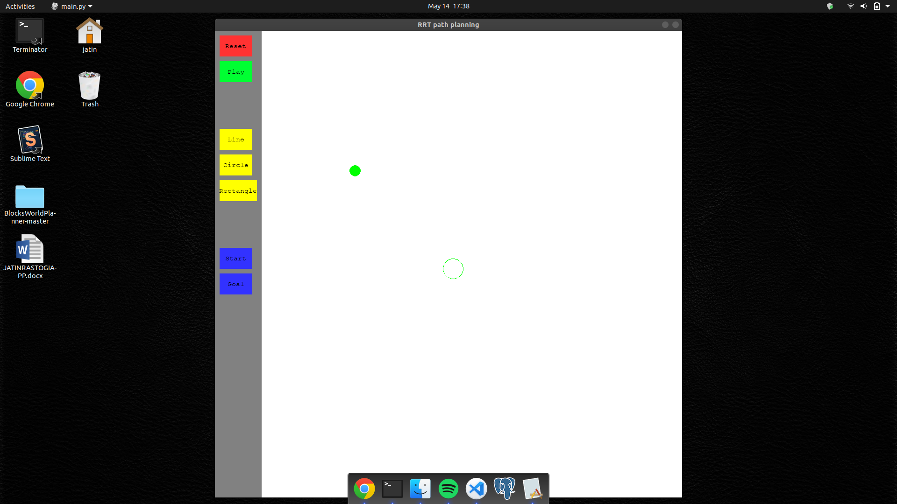
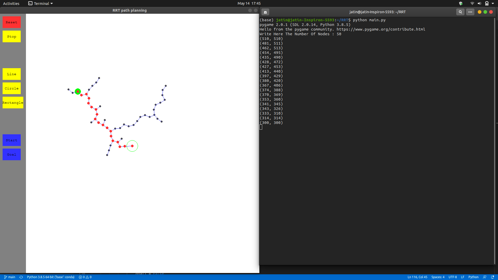
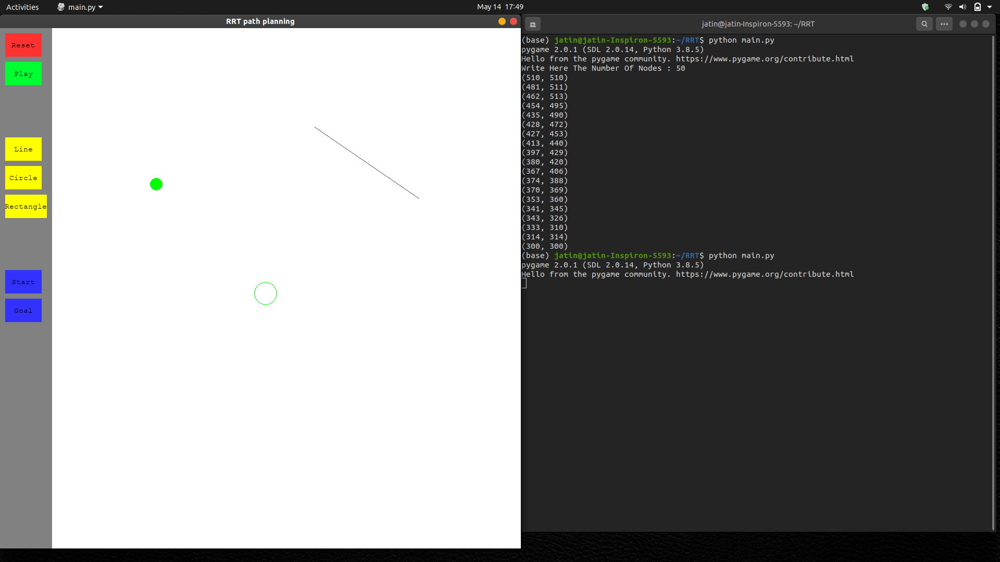
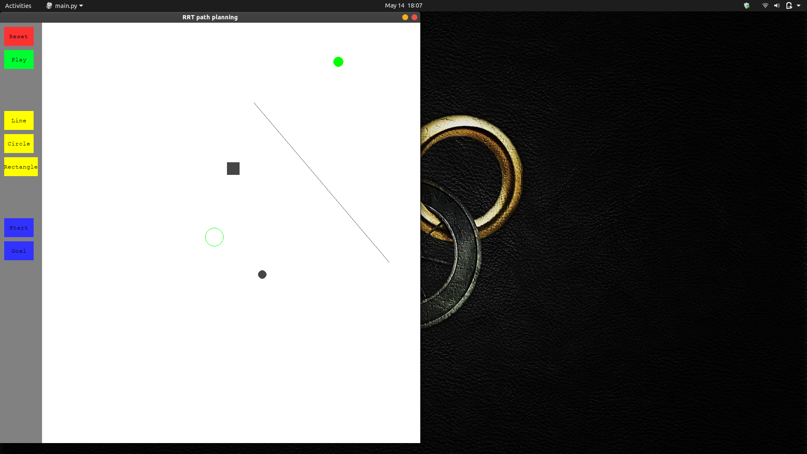

# Rapidly_exploring_random_tree_visualization
Visualization of the Rapidly-exploring Random Tree (RRT) planning algorithm.

# Introduction
  A rapidly exploring random tree (RRT) is an algorithm designed to efficiently search nonconvex, high-dimensional spaces by randomly building a space-filling tree. The tree is constructed incrementally from samples drawn randomly from the search space and is inherently biased to grow towards large unsearched areas of the problem. RRTs were developed by Steven M. LaValle and James J. Kuffner Jr. [1] .[2] They easily handle problems with obstacles and differential constraints (nonholonomic and kinodynamic) and have been widely used in autonomous robotic motion planning
  
  # Requirements
  - python 3
  - pygame
  
  
 # Run Instructions
 
   - Clone Repository
      ```
    
      git clone https://github.com/jatinrastogi/Rapidly_exploring_random_tree_visualization.git
      
      ```
    
   - Change directory to the folder
      ```
      cd [folder name]
      
      ```
   
   - Install pygame if not already installed.
      ```
   
      pip install pygame
      
      ```
   
    
   -  Execute the file
      ```
      
      python main.py
      
      ```
      
      
      
   # Features
   
   - Two green Circles are depected at the start.The filled circle means the <b> Start </b> position and the unfilled circle depicts the <b> Goal </b> 
    position.
    
   
   
   
   - When "Play" button is pressed the program asks for user input on number of nodes.After input is given RRT path is formed.

   
   
   - Here the red line from "Start" to "Goal" depicts path founded by RRT algorithm while the other blue line are just the explored paths by the algorithm.

   
   
   ## Obstructions
    
   - To make a line as an obstruction press the line button. Then on the screen press "Left" button for starting position of line and press again "Left" button for ending point.
    
   
   
  - To make a circle as an obstruction press the "circle" button. Then just drag and drop the circle according to your wish.


   
    
  - To make a rectangle as an obstruction press "rectangle" button. Then just drag and drop the rectangle according to your wish.
  
   
    
 
  ## Set Start and Goal position
  
   - To set the start position press the <b> Start </b> button on the bottom and press anywhere on the screen you want the start position to be.

   
   
   - To set the goal postion press the <b> Goal </b> button on the bottom and press anywhere on the screen you want the goal position to be.


   
   
